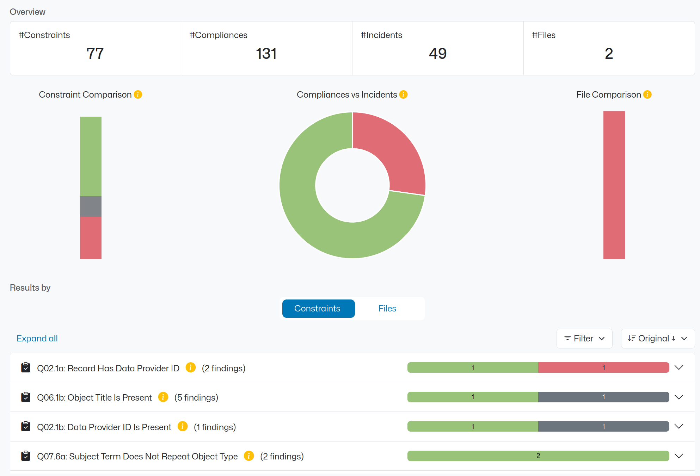
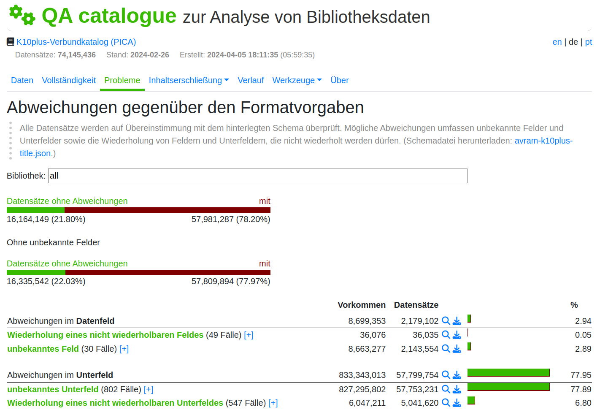
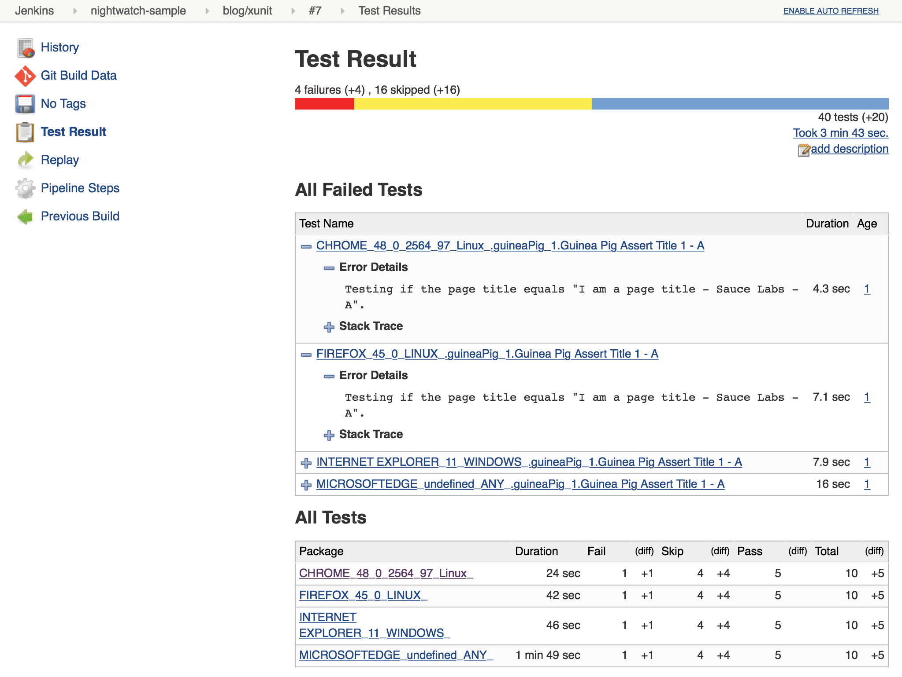
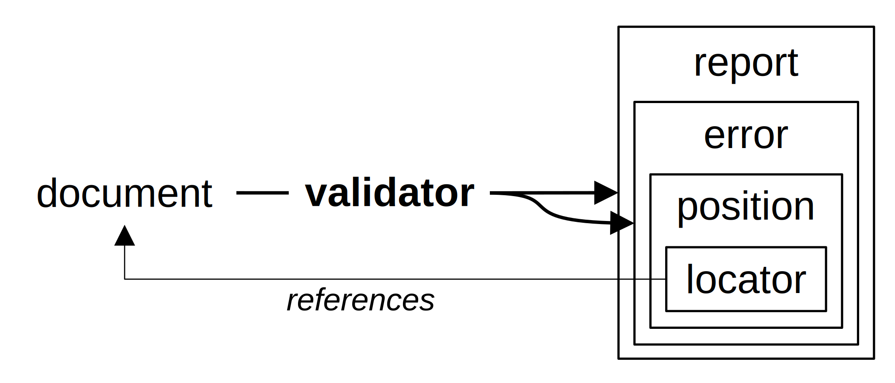

> All data is wrong, but some data is wrong on multiple levels.

# Background

---



---



---



## Motivation

- Unify how errors in data are reported by different applications
- Include information about location of errors in documents
- Support all kinds of document formats (XML, JSON, RDF, Binary...)
- Specification for implementation in project AQinDa

## Origins

- Practical Experience in Experiencing and Cleaning up dirty data
- Theoretical Work in Data Formats
- Existing tools (AQinDa, QA Catalogue, Unit Testing, Schema Validators...)

## Data Quality and Validation

- Quality = what you expect
- Validation = check against specific expectations
- Error = expectation ot met by a specific part of a document
- A myriad of expectations and possible errors

## AQinDa and Validation Error Format

- Make Expectations explicit => AQinDa
- Make Errors explicit => this format
- Share error information between applications

# The Format

## Examples

```json
{
  "message": "Syntax error at line 3",
  "position": { "line": "3" }
}
{
  "message": "Invalid record element",
  "position": { "xpath": "/records/record[1]" }
}
{
  "message": "Image width of PNG file is too large",
  "position": { "fq": "png:.chunks[0].width" }
}
{ 
  "level":"error" 
}
```

## Requirements 

- Format used since ~5 years at VZG Validation Service 
  <https://format.gbv.de/validate>
- Cover requirements of Constrainify/AQinDa
- Do One Thing And Do It Well

## Overview



## Error

- `message` - for humans, could be generated automatically
- `level` - severity (`error`: default, `warning`, or `info`)
- `types` - kinds of error
- `position` - where the error occurred in a document

## Report

- `types` - shared kinds of errors
- `totalErrors` - number of errors
- `totalCompliances` - number of non-errors
- `compliances` - position of non-errors
- `totalFindings` - sum of errors and compliances
- `complete` - whether document was fully processed
- `duration` - metadata

## Minimal Report

All fields are optional, except `errors`

```json
{"errors": []}
```

## Example Report

```json
{
  "types": [ "record-must-be-valid" ],
  "errors": [
    { "position": { "xpath": "/records/record[2]" } }
  ],
  "compliances": [
    { "xpath": "/records/record[1]" },
    { "xpath": "/records/record[3]" },
    null
  ]
}
```

## Position

Array of **locators**.

```json
[
  { "dimension": "xpath", "address": "/records/record[1]" },
  { "dimension": "line", "address": "42" }
]
```

Condense Form:

```json
{
  "xpath": "/records/record[1]",
  "line": "42"
}
```

## Locator

- Reference to a part of a document
- The part is another document
- `dimension` and `address`
- `value` of the part of the document ("snippet")
- nested `errors` OR `reports` relative to the located part

## Example: Nested Errors in a Locator

```json
{
  "dimension": "file",
  "address": "archive.zip",
  "errors": [ {
    "message": "Invalid value in line 2 in file example.txt",
    "position": [ {
      "dimension": "file",
      "address": "example.txt",
      "errors": [ { 
        "message": "Invalid element in line 2",
        "position": { "line": "2" }
      } ]
    } ]
  } ]
}
```

## Levels of description

Things can go wrong on so many levels!

```{mermaid fig-align=left}
graph LR
   XML -- XML syntax --> Unicode
   Unicode -- UTF-8   --> Bytes
   Unicode[Unicode string]

   xpath(XPath)
   char(character number)
   line(line number)
   offset

   style xpath fill:#fff,stroke:#fff
   style char fill:#fff,stroke:#fff
   style line fill:#fff,stroke:#fff
   style offset fill:#fff,stroke:#fff

   xpath -.-> XML   
   char -.-> Unicode
   line -.-> Unicode
   offset -.-> Bytes
```

## Some dimensions

name            | document           | element/part
:---------------|--------------------|------------------
`id`            | indexed set of     | -
`offset`        | sequence           | -
`line`          | seq. of strings    | string
`file`          | directory tree     | -
`jsonpointer`   | JSON               | JSON
`xpath`         | XML                | XML element/attribute
`cells`         | tabular data       | tabular data

# Summary

- Report
- Error
- Position
- Locators with Dimensions

# Open Issues

## Support skipped analysis?

- Findings = compliances + errors + skipped?

## Writing a specification

- Wording
- Good examples
- JSON Schema
- Demo implementations
- Publication via DINI, RFC...?

## Final Name

- Validation Error Format
- Error Report Format
- Error Result Format
- ...

